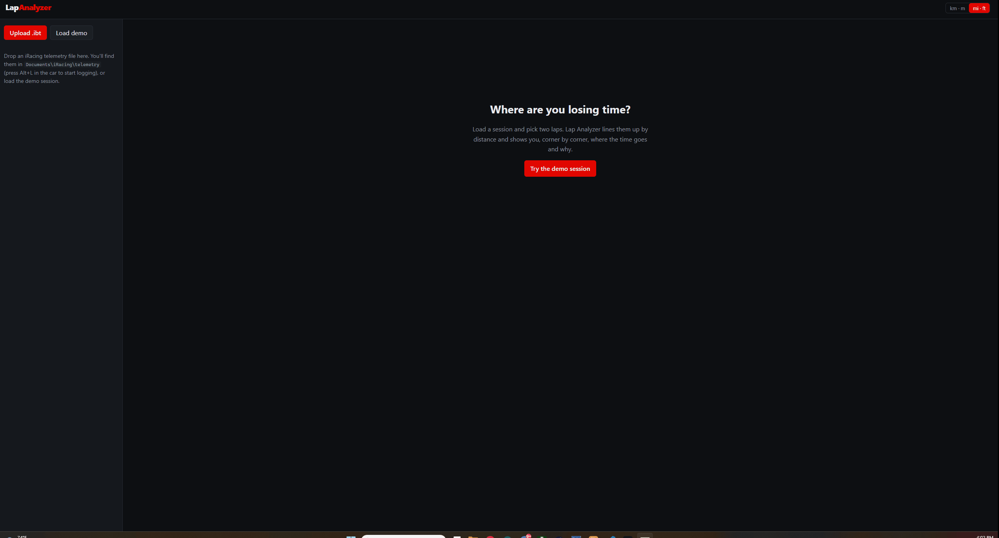

# Lap Analyzer

**Find out where you're losing time, corner by corner.** Upload iRacing telemetry (`.ibt`), pick two laps, and Lap Analyzer lines them up by distance and tells you, in plain English, what's different:

> **Turn 7:** losing 0.50s, 20% less brake pressure, 10 km/h slower at the apex.


[](https://github.com/emb1496/lap-analyzer/actions/workflows/ci.yml)

## Features

- **Native `.ibt` parser.** It reads iRacing's binary telemetry format directly. No SDK, no Windows-only dependencies.
- **Distance-aligned comparison.** Laps are resampled from time onto a shared track-position grid, so you can compare any two points on track.
- **Time-delta trace.** See exactly where on track the gap opens and closes.
- **Automatic corner detection** from the speed trace, with no per-track configuration.
- **Per-corner coaching insights.** Brake point, brake pressure, apex speed and throttle pickup are compared and summarised.
- **Track map** drawn from GPS and coloured by where time is gained (green) or lost (red).
- **Synced charts.** Hovering any chart moves the marker on every chart and on the map.
- **Built-in demo session**, so you can try it with no iRacing install.

## Quick start

Requirements: Python 3.10+ and Node 20+.

```bash
# backend
cd backend
python -m venv .venv
.venv/Scripts/activate          # macOS/Linux: source .venv/bin/activate
pip install -e ".[dev]"
uvicorn lap_analyzer.main:app --reload
```

```bash
# frontend (second terminal)
cd frontend
npm install
npm run dev
```

Open http://localhost:5173 and click **Try the demo session**. To use your own laps, enable telemetry logging in iRacing (Alt+L in the car), then drag a file from `Documents\iRacing\telemetry` onto the sidebar.

## Architecture

```
┌──────────────────────┐   multipart .ibt    ┌──────────────────────────────────────────┐
│  React + TypeScript  │ ──────────────────▶ │ FastAPI                                  │
│  (Vite, Recharts)    │                     │                                          │
│                      │ ◀────────────────── │  ibt/        binary format reader/writer │
│  SessionPanel        │   JSON comparison   │  analysis/   lap split → resample →      │
│  TrackMap (SVG)      │                     │              delta → corners → insights  │
│  CornerTable         │                     │  session.py  metadata + in-memory store  │
│  TelemetryCharts     │                     │  synthetic.py  lap sim for demo & tests  │
└──────────────────────┘                     └──────────────────────────────────────────┘
```

### How it works

1. **Parsing** ([`ibt/reader.py`](backend/lap_analyzer/ibt/reader.py)). An `.ibt` file has a fixed header, a table of variable descriptors (name, type, offset, unit) and then thousands of fixed-width records sampled at 60 Hz. The reader builds a NumPy structured dtype from the file's own descriptors and decodes every record with one `np.frombuffer` call, so a 30-minute session loads in milliseconds.
2. **Lap splitting** ([`analysis/laps.py`](backend/lap_analyzer/analysis/laps.py)). A lap starts when the lap counter increments and the lap position wraps from ~1.0 to ~0.0. The crossing time is *interpolated* between the samples either side of the line. Without this, lap times would be off by up to one sample (16 ms). Out-laps, in-laps and laps that touch pit road are flagged as invalid.
3. **Resampling.** Telemetry is sampled in time, but laps can only be compared in *distance*. Each lap is interpolated onto a common grid (every ~2 m), and the time delta is simply `t_cmp(d) − t_ref(d)`.
4. **Corners** ([`analysis/compare.py`](backend/lap_analyzer/analysis/compare.py)). Apexes are local speed minima with a real braking zone before them. The lap is cut into one segment per corner at the point where the *slower* lap peaks. That way an early-braking lap has its loss charged to the corner it was braking for, and the corner deltas add up exactly to the lap delta.
5. **Insights.** For each corner, brake point, peak brake pressure, minimum speed and the return to full throttle are compared and turned into a sentence.

### Testing without iRacing

[`synthetic.py`](backend/lap_analyzer/synthetic.py) is a small quasi-steady-state lap simulator. It builds a closed circuit, caps corner speed by lateral grip and applies acceleration and braking limits. It then writes the result as a real `.ibt` file through the same binary writer the tests use. Each lap is driven by a `DriverProfile`, so the tests can plant a specific mistake (for example 80% brake pressure, or overslowing one corner) and assert that the analyzer finds it:

```python
def test_insights_explain_where_and_why_time_was_lost(session):
    worst = max(corners, key=lambda c: c.time_delta)
    assert 0.57 <= worst.apex / session.track_length <= 0.65   # the corner we sabotaged
    assert "slower at the apex" in worst.insight
```

Lap times are checked against the simulator's ground truth to within 1 ms.

```bash
cd backend && pytest
```

## API

| Method | Path | |
| --- | --- | --- |
| `POST` | `/api/sessions` | Upload an `.ibt` file (multipart field `file`) |
| `POST` | `/api/sessions/demo` | Load the synthetic demo session |
| `GET` | `/api/sessions` | List loaded sessions and their laps |
| `GET` | `/api/compare?ref_session=&ref_lap=&cmp_session=&cmp_lap=` | Full lap comparison |

Interactive docs are at http://localhost:8000/docs while the backend is running.

## Roadmap

- [ ] Zoom and brush on the charts to inspect a single corner
- [ ] Steering and gear overlays; a "line" view comparing GPS paths
- [ ] Track conditions comparison
- [ ] Persist sessions (SQLite + file storage) instead of the in-memory store
- [ ] Reference lap library: compare against shared laps from faster drivers on the same car and track
- [ ] Live mode: read iRacing's shared-memory telemetry while driving and show a real-time delta
- [ ] Docker Compose and a hosted demo

## License

MIT
